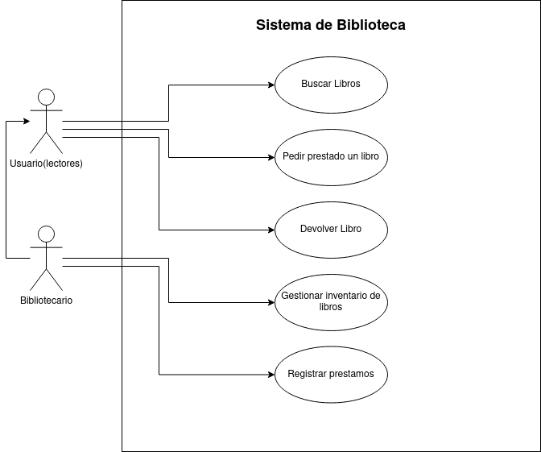

# tarea-diagramas
## Ejercicio 1: Biblioteca

|  Actor | Lector |
|---|---|
| Descripción  | _Es un usuario que puede realizar algunas acciones_  |
| Características  | __ |
| Relaciones | __  |
| Referencias | _Buscar libro,pedir prestado un libro, devolver libro_ |   
|  Notas |  __ |
| Autor  | _Alejandro Salazar Gonzalez_ |
|Fecha | _6/11/2024_ |

|  Atributo |||
|---|---|---|
| _Nombre_  | _Descripción_  | _Tipo_ |
| | |

---

|  Actor | Bibliotecario |
|---|---|
| Descripción  | _Es el administrador de la biblioteca_  |
| Características  | __ |
| Relaciones | _Lector_  |
| Referencias | _Buscar libro,pedir prestado un libro, devolver libro, Gestionar inventario de libros, registrar prestamos_ |   
|  Notas |  __ |
| Autor  | _Alejandro Salazar Gonzalez_ |
|Fecha | _6/11/2024_ |

|  Atributo |||
|---|---|---|
| _Nombre_  | _Descripción_  | _Tipo_ |
| | |

---

|  Caso de Uso	CU | Buscar libro  |
  |---|---|
  | Fuentes  | _Documento_  |
  | Actor  |  _Lector, Bibliotecario_ |
  | Descripción | _El actor busca un libro en la biblioteca_  |
  | Flujo básico | _Descripción paso a paso de la ejecución. (1->2->3.)_ |
  | Pre-condiciones | __  |  
  | Post-condiciones  | __  |  
  |  Requerimientos | __  |
  |  Notas |  __ |
  | Autor  | _Alejandro Salazar González_ |
  |Fecha | _6/11/2024_ |

  |  Caso de Uso	CU | Pedir Prestamo |
  |---|---|
  | Fuentes  | _Documento_  |
  | Actor  |  _Lector, Bibliotecario_ |
  | Descripción | _El actor pide un libro en la biblioteca_  |
  | Flujo básico | _Descripción paso a paso de la ejecución. (1->2->3.)_ |
  | Pre-condiciones | __  |  
  | Post-condiciones  | __  |  
  |  Requerimientos | __  |
  |  Notas |  __ |
  | Autor  | _Alejandro Salazar González_ |
  |Fecha | _6/11/2024_ |

  ---

  |  Caso de Uso	CU | Devolver un libro  |
  |---|---|
  | Fuentes  | _Documento_  |
  | Actor  |  _Lector, Bibliotecario_ |
  | Descripción | _El actor devuelve un libro de la biblioteca_  |
  | Flujo básico | _Descripción paso a paso de la ejecución. (1->2->3.)_ |
  | Pre-condiciones | _Haber pedido un libro anteriormente_  |  
  | Post-condiciones  | __  |  
  |  Requerimientos | __  |
  |  Notas |  __ |
  | Autor  | _Alejandro Salazar González_ |
  |Fecha | _6/11/2024_ |

  ---

  |  Caso de Uso	CU | Buscar libro  |
  |---|---|
  | Fuentes  | _Documento_  |
  | Actor  |  _Lector, Bibliotecario_ |
  | Descripción | _El actor busca un libro en la biblioteca_  |
  | Flujo básico | _Descripción paso a paso de la ejecución. (1->2->3.)_ |
  | Pre-condiciones | __  |  
  | Post-condiciones  | __  |  
  |  Requerimientos | __  |
  |  Notas |  __ |
  | Autor  | _Alejandro Salazar González_ |
  |Fecha | _6/11/2024_ |

  ---

  |  Caso de Uso	CU | Gestionar inventario de libros  |
  |---|---|
  | Fuentes  | _Documento_  |
  | Actor  |  _Bibliotecario_ |
  | Descripción | _El actor modifica el inventario de la biblioteca_  |
  | Flujo básico | _Descripción paso a paso de la ejecución. (1->2->3.)_ |
  | Pre-condiciones | __  |  
  | Post-condiciones  | __  |  
  |  Requerimientos | __  |
  |  Notas |  __ |
  | Autor  | _Alejandro Salazar González_ |
  |Fecha | _6/11/2024_ |

  ---

  |  Caso de Uso	CU | Registrar préstamos  |
  |---|---|
  | Fuentes  | _Documento_  |
  | Actor  |  _Bibliotecario_ |
  | Descripción | _El actor registra el prestamo de un libro_  |
  | Flujo básico | _Descripción paso a paso de la ejecución. (1->2->3.)_ |
  | Pre-condiciones | __  |  
  | Post-condiciones  | __  |  
  |  Requerimientos | __  |
  |  Notas |  __ |
  | Autor  | _Alejandro Salazar González_ |
  |Fecha | _6/11/2024_ |

  ## Ejercicio 2: Sistema de Compras en Línea
  
  
|  Actor | Cliente |
|---|---|
| Descripción  | _Es un usuario que puede realizar algunas acciones_  |
| Características  | __ |
| Relaciones | __  |
| Referencias | _Buscar productos, añadir productos al carrito, realizar pedido, realizar pago_ |   
|  Notas |  __ |
| Autor  | _Alejandro Salazar Gonzalez_ |
|Fecha | _6/11/2024_ |

|  Atributo |||
|---|---|---|
| _Nombre_  | _Descripción_  | _Tipo_ |
| | |

---

|  Actor | Administrador |
|---|---|
| Descripción  | _Es un usuario que gestiona el sistema_  |
| Características  | __ |
| Relaciones | __  |
| Referencias | _Buscar productos, añadir productos al carrito, realizar pedido, realizar pago, gestionar catálogo de productos_ |   
|  Notas |  __ |
| Autor  | _Alejandro Salazar Gonzalez_ |
|Fecha | _6/11/2024_ |

|  Atributo |||
|---|---|---|
| _Nombre_  | _Descripción_  | _Tipo_ |
| | |

---

  |  Caso de Uso	CU | Buscar productos  |
  |---|---|
  | Fuentes  | _Documento_  |
  | Actor  |  _Usuario, administrador_ |
  | Descripción | _El actor busca un producto en el sistema_  |
  | Flujo básico | _Descripción paso a paso de la ejecución. (1->2->3.)_ |
  | Pre-condiciones | __  |  
  | Post-condiciones  | __  |  
  |  Requerimientos | __  |
  |  Notas |  __ |
  | Autor  | _Alejandro Salazar González_ |
  |Fecha | _6/11/2024_ |

  ---

  |  Caso de Uso	CU | Añadir productos al carrito  |
  |---|---|
  | Fuentes  | _Documento_  |
  | Actor  |  _Usuario, administrador_ |
  | Descripción | _El actor agrega un producto a su lista de compra_  |
  | Flujo básico | _Descripción paso a paso de la ejecución. (1->2->3.)_ |
  | Pre-condiciones | _Haber buscado un producto_  |  
  | Post-condiciones  | __  |  
  |  Requerimientos | __  |
  |  Notas |  __ |
  | Autor  | _Alejandro Salazar González_ |
  |Fecha | _6/11/2024_ |

  ---
  |  Caso de Uso	CU | Realizar pedido  |
  |---|---|
  | Fuentes  | _Documento_  |
  | Actor  |  _Usuario, administrador_ |
  | Descripción | _El actor apide lo que hay en su lista de compra_  |
  | Flujo básico | _Descripción paso a paso de la ejecución. (1->2->3.)_ |
  | Pre-condiciones | _Haber añadido un producto minimo al carrito_  |  
  | Post-condiciones  | __  |  
  |  Requerimientos | __  |
  |  Notas |  __ |
  | Autor  | _Alejandro Salazar González_ |
  |Fecha | _6/11/2024_ |

  ---

  |  Caso de Uso	CU | Realizar pago  |
  |---|---|
  | Fuentes  | _Documento_  |
  | Actor  |  _Usuario, administrador_ |
  | Descripción | _El actor paga lo que hay en su lista de compra_  |
  | Flujo básico | _Descripción paso a paso de la ejecución. (1->2->3.)_ |
  | Pre-condiciones | _Haber riealizado un pedido_  |  
  | Post-condiciones  | __  |  
  |  Requerimientos | __  |
  |  Notas |  __ |
  | Autor  | _Alejandro Salazar González_ |
  |Fecha | _6/11/2024_ |

  ---

  |  Caso de Uso	CU | Gestionar catálogo de productos  |
  |---|---|
  | Fuentes  | _Documento_  |
  | Actor  |  _Usuario, administrador_ |
  | Descripción | _El actor paga lo que hay en su lista de compra_  |
  | Flujo básico | _Descripción paso a paso de la ejecución. (1->2->3.)_ |
  | Pre-condiciones | _Haber riealizado un pedido_  |  
  | Post-condiciones  | __  |  
  |  Requerimientos | __  |
  |  Notas |  __ |
  | Autor  | _Alejandro Salazar González_ |
  |Fecha | _6/11/2024_ |